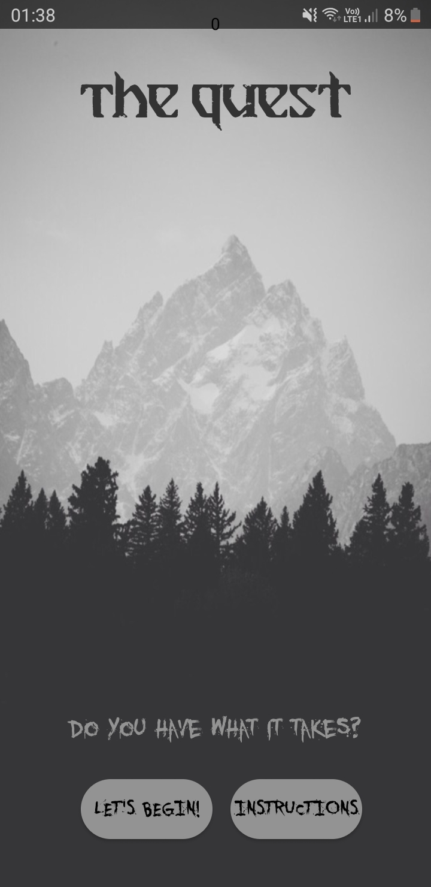
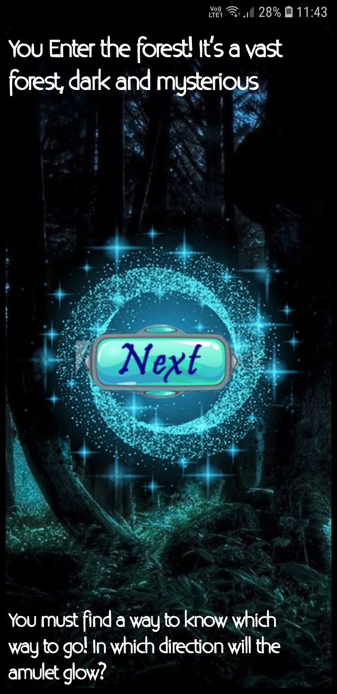
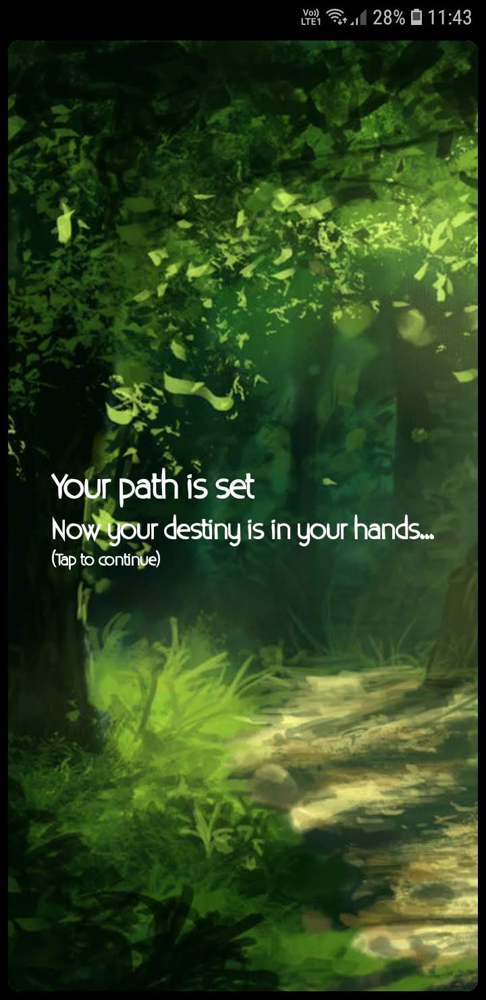
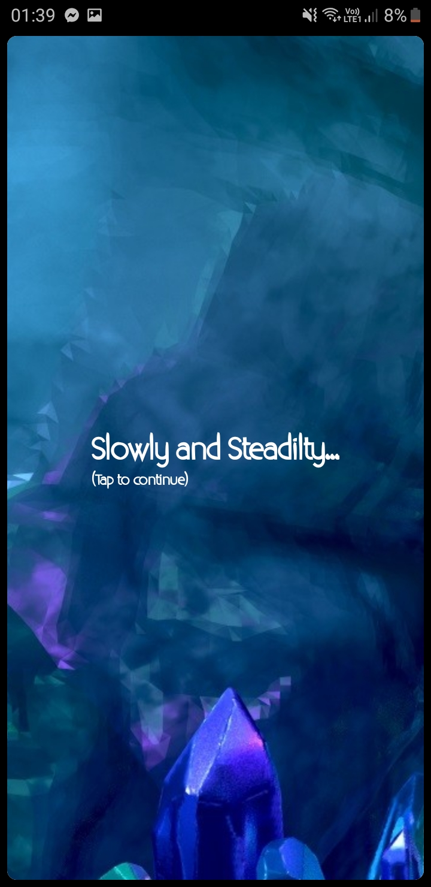

# DD-Game

An user interactive game, set in the medival times. The player has to use the external sensors in order to progress in the game, but it isn't easy! Each card has a sensor, and a tale to tell. Can you reach the end? Do you have what it takes?

